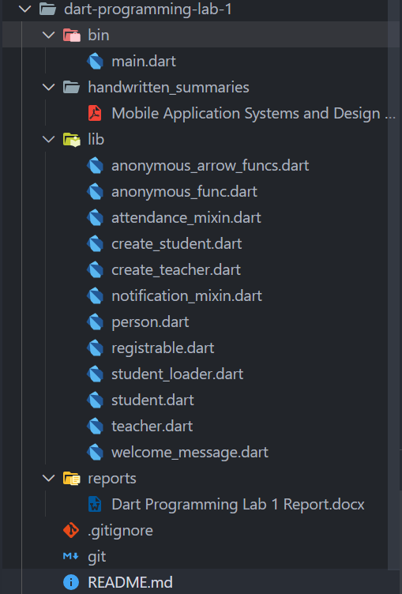
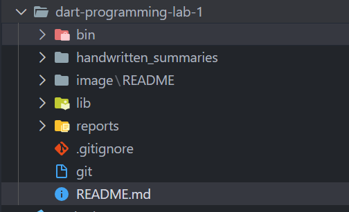

# Dart Programming Lab 1

## Student Information

- Course: Mobile Application Systems and Design
- Assignment: Dart Programming Lab 1

## Project Overview

This laboratory assignment is designed to practice core Dart programming concepts.
All solutions were implemented individually as required, with clear outputs and supporting documentation.

The project demonstrates the following Dart concepts:

- Functions and parameters
- Classes and constructors
- Inheritance
- Interfaces and mixins
- Collections (List and Map)
- Anonymous and arrow functions
- Asynchronous programming using `async` and `await`

## Project Structure

The project is organized using a modular structure to improve readability and maintainability.
All Dart files are imported and executed through a single entry point.





The image folder added above contains the folder structure's screenshots.

## Repository Contents

- Dart source code files
- Scanned handwritten summaries
- Word document containing output screenshots and explanations

## How to Run the Project

Ensure Dart SDK is installed, then run:

```bash
dart run bin/main.dart or dart main.dart
```
